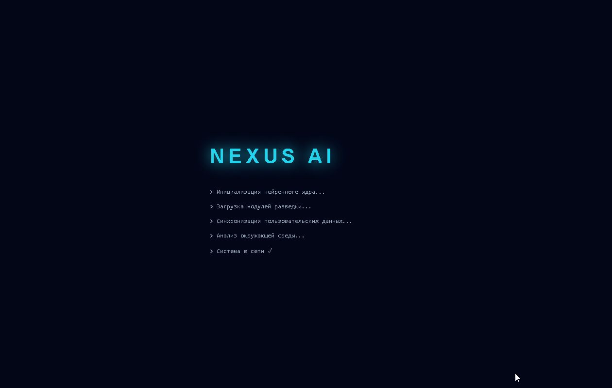
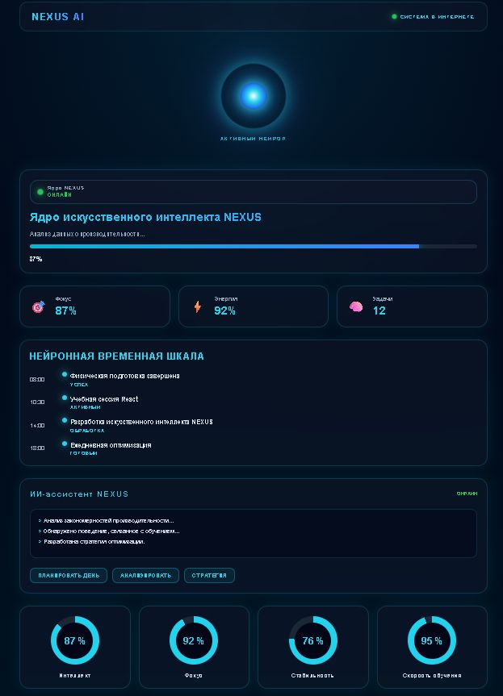
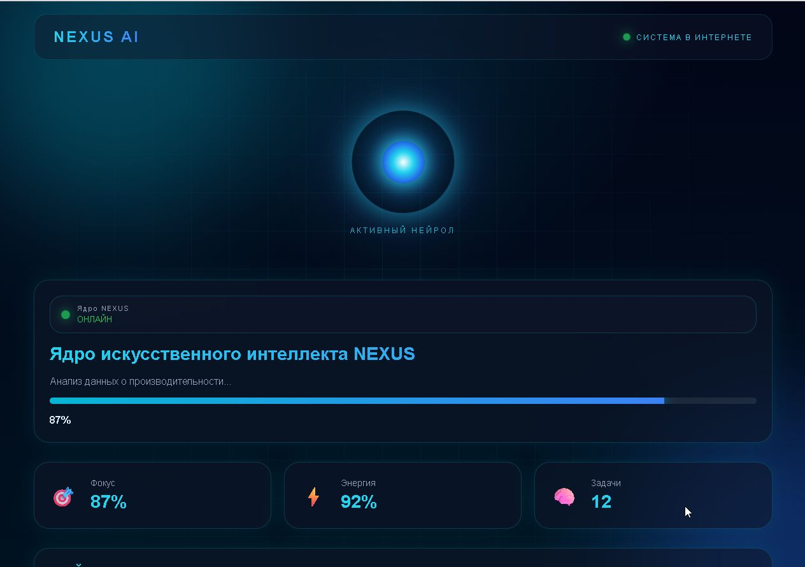

# 🧠 NEXUS AI

> Futuristic AI productivity dashboard built with React and TypeScript.

NEXUS AI is a futuristic interface concept inspired by cyberpunk systems, artificial intelligence assistants and next-generation productivity tools.

The project focuses on modern UI/UX, animations and immersive dashboard experience.

---

## 🚀 Features

✨ Cyberpunk inspired interface  
🤖 AI Core dashboard  
🔮 Animated AI Orb  
📊 Productivity statistics  
🧠 Neural activity timeline  
💬 AI Assistant panel  
📈 Neural metrics visualization  
⚡ Boot sequence animation  
🌊 Glassmorphism UI

---

## 🛠 Tech Stack

- React
- TypeScript
- Vite
- Framer Motion
- CSS3
- Responsive Design

---

## 📂 Project Structure

src
├── components
│ ├── dashboard
│ ├── layout
│ └── ui
│
├── pages
│
├── styles
│
└── App.tsx

---

## 🎨 Design Concept

NEXUS AI combines:

- futuristic HUD interfaces;
- cyberpunk aesthetics;
- glassmorphism;
- AI assistant experience;
- productivity analytics.

The goal is to create a feeling of interacting with a personal AI operating system.

---

## 📂 Repository

https://github.com/96Yoshida69/NEXUS-AI

---

## 📸 Preview

---

## 🌐 Live Demo

https://nexus-ai-mauve.vercel.app/

---

## 👨‍💻 Author

Created by Ilia K

Frontend Developer
